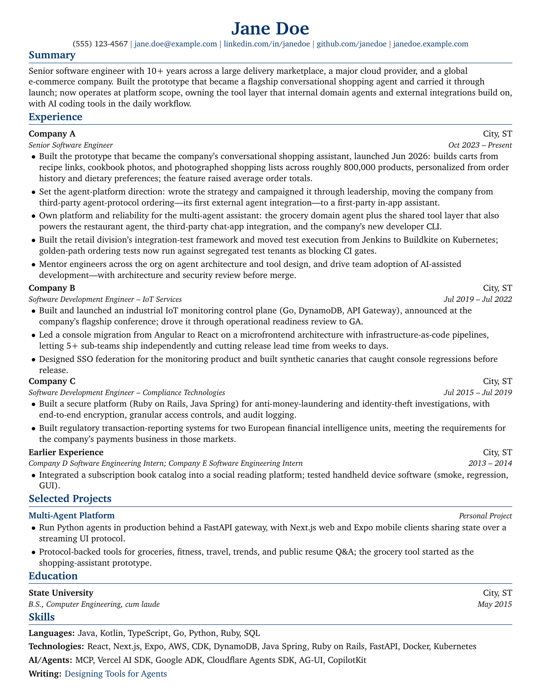

# LaTeX Resume Template · Turn structured facts into a readable PDF

[](https://github.com/aranlucas/resume-template/actions/workflows/workflow-syntax.yml)
[](LICENSE)

`resume-template` turns a [JSON Resume](https://jsonresume.org/schema) file
into an ATS-readable LaTeX source file and PDF. It gives a resume repository a
repeatable handoff: keep structured facts in Git, choose a focused one-page
resume or a fuller CV, and publish a fresh artifact when the source changes.

> **The useful loop:** edit `resume.json` once, let GitHub Actions render the
> `.tex` and `.pdf`, and give a reviewer a polished document that still has a
> source file behind it.

<p align="center">
  
</p>

[`resume.json`](resume.json) contains intentionally generic placeholder data;
[`resume.pdf`](resume.pdf) is the checked-in result of rendering it.

Two templates in [`templates/`](templates):

- `resume` (default): one page, 10pt Charter. Work, projects, education, skills.
- `cv`: multi-page, 12pt Latin Modern with contact icons. Education, work, research,
  publications, volunteer, leadership, awards, skills, certificates, languages and
  interests, each skipped when empty. Section titles can be renamed with `meta.titles`;
  the comment at the top of [`cv.tex`](templates/cv.tex) lists its custom fields.

## Use it from your own repo

Commit your `resume.json` and add a workflow that calls this repo's reusable
workflow. It builds the PDF on GitHub Actions (no local TeX needed) and commits
`<output>.tex`/`<output>.pdf` back on push; pull requests get them as an artifact.

```yaml
# .github/workflows/pdf.yml
name: PDF
on:
  push:
    branches: [main]
    paths: [resume.json]
  pull_request:
    paths: [resume.json]
  workflow_dispatch:
jobs:
  pdf:
    uses: aranlucas/resume-template/.github/workflows/build-resume.yml@main
    permissions:
      contents: write
    with:
      output: Jane_Doe_Resume # default: resume
      template: cv # default: resume
```

Dates must be `YYYY-MM` (or `YYYY`, e.g. for awards). Completed jobs whose position
ends in "Intern" and have both dates are merged into one "Earlier Experience" entry. Ongoing internships stay separate with "Present";
missing dates are omitted and optional highlights may be absent or empty. In the
resume layout, `publications` render as a one-line "Writing" row.

## Build locally

Install a TeX distribution such as [MacTeX](https://www.tug.org/mactex/) or
[TeX Live](https://www.tug.org/texlive/) so `pdflatex` is on your `PATH`, then:

```bash
pnpm install
pnpm pdf        # resume.json → resume.tex → resume.pdf
```

From another repo, add this one as a dependency (for example
`"resume-template": "link:../resume-template"`) and run
`resume-template <resume.json> [output name] [--template cv]`. The package also exports
`loadResume`, `assertJsonResume`, `createRenderer`, `renderResumeDocument`, and
`buildPdf`. Use `renderResumeDocument(data, { template: "resume", searchPaths: [] })`
to validate JSON Resume data and supported dates and return TeX without writing files.
`buildPdf(data, output, options)` uses the same validation and rendering operation.
Use `createRenderer(searchPaths)` for custom Nunjucks/Markdown templates with the same
filters; it remains generic and does not impose JSON Resume validation.

PDF builds use a temporary output directory with shell escape disabled and a two-minute
compiler timeout. A failed build leaves existing `.tex`/`.pdf` outputs unchanged and
copies the compiler log to `<output>.log` when available. Relative LaTeX inputs are
still resolved from the output directory. Only the final `.tex`, `.pdf`, and diagnostic
`.log` are retained.

## Source map and contracts

- `bin/resume-template.mjs` is the CLI entry point.
- `lib/resume.mjs` loads and validates JSON Resume data.
- `lib/render.mjs` validates document input and configures Nunjucks and LaTeX-safe filters.
- `lib/pdf.mjs` writes `.tex` and invokes `pdflatex`.
- `templates/resume.tex` is the one-page layout; `templates/cv.tex` is the
  multi-page CV layout.
- `resume.tex` and `resume.pdf` are generated artifacts. Edit
  [`resume.json`](resume.json) or a template, then regenerate them.

Values in the templates must pass through the provided `tex` filter (or `url`
inside `\\href{}`), and dates should use `YYYY` or `YYYY-MM`. The default
template is designed to fit one page; content changes should be checked with
`pdfinfo`, `pdftotext`, and a rendered preview.

## Verification

```bash
pnpm test       # renderer, custom templates, CLI and controlled compiler regressions
pnpm test:pdf   # real TeX/PDF and ATS text checks; requires TeX Live and Poppler
```

The real-PDF checks use synthetic data and the public placeholder sample. The `cv`
layout additionally requires Latin Modern and the `fontawesome` LaTeX package
(typically `lmodern` and `texlive-fonts-extra` on Debian/Ubuntu). Check your TeX
installation before running `test:pdf`. The GitHub PDF workflow runs the fast
regression suite in addition to rendering the sample.

## Status

The package is a small, stable renderer rather than a resume editor or hosted
service. The reusable workflow installs TeX on GitHub-hosted runners, uploads
the generated files on pull requests, and commits them on pushes when the
caller grants `contents: write`.
